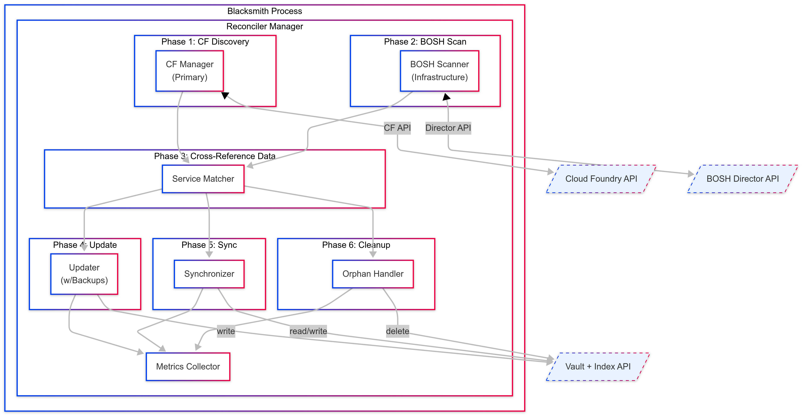

# Blacksmith Deployment Reconciler

## Overview

The Blacksmith Deployment Reconciler is a background service that automatically synchronizes service instance deployments information and state between Cloud Foundry (CF), BOSH Director, and Vault. It uses a CF-Query approach to ensure that
previously deployed active in CF services remain visible and manageable in Blacksmith even after restarts, failures, or data corruption.

## Purpose

The reconciler addresses the following operational challenges:

1. **Service Discovery** Finds all service instances deployed through Blacksmith by querying CF service broker endpoints
2. **Infrastructure Mapping** Correlates CF service instances with their corresponding BOSH deployments for infrastructure details
3. **Data Synchronization** Updates Vault with service instance metadata queried from both CF and BOSH
4. **Index Maintenance** Keeps the service instance index current and accurate
5. **Orphan Detection** Identifies orphaned instances (CF instances without BOSH deployments or vice versa)
6. **Credential Recovery** Reconstructs missing binding credentials from deployment manifests
7. **State Consistency** Ensures Blacksmith's internal state matches the actual deployed infrastructure and service names

## Architecture

The reconciler is implemented as a modular system with clean separation of concerns.



### Core Components

#### Manager (`reconcilerManager`)
- **Purpose**: Orchestrates the entire reconciliation workflow as a background goroutine
- **Responsibilities**:
  - Manages reconciliation lifecycle and scheduling
  - Coordinates all phases of the reconciliation process
  - Handles graceful shutdown and error recovery
  - Tracks reconciliation status and metrics

#### CF Manager
- **Purpose**: Primary source of service instance discovery
- **Responsibilities**:
  - Queries CF service broker endpoints for active service instances
  - Retrieves service instance metadata and binding information
  - Provides authoritative list of what should exist in Blacksmith

#### BOSH Scanner (`boshScanner`)
- **Purpose**: Scans BOSH Director for infrastructure details with intelligent caching
- **Responsibilities**:
  - Retrieves deployment information from BOSH Director
  - Caches deployment details to reduce API load
  - Extracts infrastructure metadata (VMs, releases, stemcells)
  - Parses manifest properties for service identification

#### Service Matcher (`serviceMatcher`)
- **Purpose**: Correlates CF service instances with BOSH deployments using multiple strategies
- **Responsibilities**:
  - Matches CF service instances to BOSH deployments by UUID
  - Uses manifest metadata for alternative matching
  - Validates deployment manifest structure
  - Handles edge cases and partial matches

#### Vault Updater (`vaultUpdater`)
- **Purpose**: Updates Vault storage with  instance data and manages backups
- **Responsibilities**:
  - Creates automatic backups before updates using SHA256-based deduplication
  - Updates instance metadata with reconciliation history
  - Manages backup retention and cleanup
  - Handles credential recovery and binding repair

#### Index Synchronizer (`indexSynchronizer`)
- **Purpose**: Maintains the service instance index for fast lookups
- **Responsibilities**:
  - Updates the central service instance index
  - Validates index consistency
  - Handles legacy deployment name formats
  - Ensures index accurately reflects current state

#### Metrics Collector (`metricsCollector`)
- **Purpose**: Tracks operational metrics for monitoring and observability
- **Responsibilities**:
  - Collects reconciliation performance metrics
  - Tracks error rates and recent failures
  - Provides Prometheus-compatible metrics export
  - Monitors system health indicators

## Configuration

The reconciler can be configured through both the `blacksmith.conf` file and environment variables
(environment variables take precedence):

### Configuration Options

| Environment Variable | Config File | Default | Description |
|---------------------|-------------|---------|-------------|
| `BLACKSMITH_RECONCILER_ENABLED` | `reconciler.enabled` | `true` | Enable/disable the reconciler |
| `BLACKSMITH_RECONCILER_INTERVAL` | `reconciler.interval` | `1h` | Time between reconciliation runs |
| `BLACKSMITH_RECONCILER_MAX_CONCURRENCY` | `reconciler.max_concurrency` | `5` | Maximum concurrent deployment processing |
| `BLACKSMITH_RECONCILER_BATCH_SIZE` | `reconciler.batch_size` | `10` | Number of deployments to process per batch |
| `BLACKSMITH_RECONCILER_RETRY_ATTEMPTS` | `reconciler.retry_attempts` | `3` | Number of retry attempts for failed operations |
| `BLACKSMITH_RECONCILER_RETRY_DELAY` | `reconciler.retry_delay` | `10s` | Delay between retry attempts |
| `BLACKSMITH_RECONCILER_CACHE_TTL` | `reconciler.cache_ttl` | `5m` | Cache time-to-live for deployment details |
| `BLACKSMITH_RECONCILER_DEBUG` | `reconciler.debug` | `false` | Enable detailed debug logging |

#### Backup Configuration

| Environment Variable | Config File | Default | Description |
|---------------------|-------------|---------|-------------|
| `BLACKSMITH_RECONCILER_BACKUP_ENABLED` | `reconciler.backup.enabled` | `true` | Enable/disable instance backups |
| `BLACKSMITH_RECONCILER_BACKUP_RETENTION` | `reconciler.backup.retention_count` | `5` | Number of backups to keep per instance |
| `BLACKSMITH_RECONCILER_BACKUP_RETENTION_DAYS` | `reconciler.backup.retention_days` | `0` | Days to retain backups (0 = disabled) |
| `BLACKSMITH_RECONCILER_BACKUP_COMPRESSION` | `reconciler.backup.compression_level` | `9` | Compression level (1-9, 9 = best) |
| `BLACKSMITH_RECONCILER_BACKUP_CLEANUP` | `reconciler.backup.cleanup_enabled` | `true` | Enable automatic cleanup of old backups |
| `BLACKSMITH_RECONCILER_BACKUP_ON_UPDATE` | `reconciler.backup.backup_on_update` | `true` | Create backup before instance updates |
| `BLACKSMITH_RECONCILER_BACKUP_ON_DELETE` | `reconciler.backup.backup_on_delete` | `true` | Create backup before instance deletion |

### Advanced Backup System

The reconciler implements a backup system with SHA256-based deduplication:

#### Backup Features
- **SHA256 Deduplication**: Prevents duplicate backups by content hashing
- **Automatic Backups**: Created before each reconciliation update
- **Configurable Retention**: Support for both count-based and time-based retention
- **Smart Cleanup**: Automatically removes old backups beyond retention limits
- **Compression**: Configurable compression levels (1-9) for space efficiency
- **Legacy Migration**: Automatically migrates old backup formats

#### What Gets Backed Up
- Complete instance Vault tree (all paths under the instance ID)
- Instance index data (service ID, plan ID, timestamps)
- Instance metadata (releases, stemcells, VMs, properties)
- Instance manifest (full BOSH deployment manifest)
- Binding credentials and metadata
- Reconciliation history and audit trail

#### Backup Storage Architecture
Backups use a SHA256-based storage system to prevent duplication:

```
backups/{instanceID}/{sha256hash}
├── timestamp: 1704397200
└── archive: <compressed_vault_export>
```

Example: `backups/abc-123-def-456/a1b2c3d4e5f6.../`

This approach ensures:
- **Space Efficiency**: Identical content is stored only once
- **Integrity Verification**: SHA256 hashes provide data integrity checks
- **Fast Deduplication**: Quick comparison without decompressing archives

### Configuration File Example

```yaml
# blacksmith.conf
# Enhanced Reconciler Configuration Example
# This configuration is optimized for handling hundreds of service instances

reconciler:
  # Basic settings
  enabled: true
  interval: "30m"
  debug: false
  max_concurrency: 10
  batch_size: 20
  retry_attempts: 5
  retry_delay: "15s"
  cache_ttl: "10m"

  # Concurrency controls - Critical for preventing overload
  concurrency:
    max_concurrent: 4              # Process max 4 deployments simultaneously
    max_deployments_per_run: 100   # Limit deployments per reconciliation run
    queue_size: 1000               # Work queue size
    worker_pool_size: 10           # Number of worker goroutines
    cooldown_period: "2s"          # Delay between batches to prevent bursts

  # API-specific rate limiting and circuit breakers
  apis:
    bosh:
      rate_limit:
        requests_per_second: 10    # Max 10 requests/second to BOSH
        burst: 5                   # Allow burst of 5 requests
        wait_timeout: "5s"         # Max time to wait for rate limit
      circuit_breaker:
        enabled: true
        failure_threshold: 5       # Open circuit after 5 failures
        success_threshold: 2       # Close circuit after 2 successes
        timeout: "60s"            # Wait 60s before attempting recovery
        max_concurrent: 1         # Max concurrent requests when half-open
      timeout: "30s"              # Request timeout
      max_connections: 10         # Connection pool size
      keep_alive: "30s"          # Keep-alive interval

    cf:
      rate_limit:
        requests_per_second: 20    # CF can handle more requests
        burst: 10
        wait_timeout: "5s"
      circuit_breaker:
        enabled: true
        failure_threshold: 3       # CF is more critical, fail faster
        success_threshold: 2
        timeout: "30s"
        max_concurrent: 2
      timeout: "15s"
      max_connections: 20
      keep_alive: "30s"

    vault:
      rate_limit:
        requests_per_second: 50    # Vault is fast, allow more
        burst: 20
        wait_timeout: "3s"
      circuit_breaker:
        enabled: true
        failure_threshold: 5
        success_threshold: 2
        timeout: "45s"
        max_concurrent: 3
      timeout: "10s"
      max_connections: 30
      keep_alive: "30s"

  # Retry configuration with exponential backoff
  retry:
    max_attempts: 3
    initial_delay: "1s"           # Start with 1 second delay
    max_delay: "30s"             # Cap at 30 seconds
    multiplier: 2.0              # Double delay each retry
    jitter: 0.1                  # Add 10% jitter to prevent thundering herd
    retryable_errors:            # Patterns to retry
      - "timeout"
      - "connection refused"
      - "rate limit"
      - "temporary"

  # Batch processing configuration
  batch:
    size: 10                     # Process 10 items per batch
    delay: "500ms"              # Delay between batches
    max_parallel_batch: 2       # Max 2 batches in parallel
    adaptive_scaling: true      # Adjust batch size based on performance
    min_size: 5                 # Minimum batch size
    max_size: 50               # Maximum batch size

  # Timeout configuration
  timeouts:
    reconciliation_run: "15m"    # Overall reconciliation timeout
    deployment_scan: "5m"        # BOSH deployment scan timeout
    instance_discovery: "3m"     # CF instance discovery timeout
    vault_operations: "2m"       # Vault operations timeout
    health_check: "30s"         # Health check timeout
    shutdown_grace_period: "30s" # Graceful shutdown timeout

  # Metrics collection
  metrics:
    enabled: true
    collection_interval: "30s"   # Collect metrics every 30 seconds
    retention_period: "24h"      # Keep metrics for 24 hours
    export_prometheus: true      # Export to Prometheus
    prometheus_port: 9090        # Prometheus metrics port

  # Backup configuration (existing)
  backup:
    enabled: true
    retention_count: 5           # Keep 5 backups
    retention_days: 7           # Keep backups for 7 days
    compression_level: 9        # Maximum compression
    cleanup_enabled: true       # Auto cleanup old backups
    backup_on_update: true      # Backup before updates
    backup_on_delete: true      # Backup before deletes

# Production configuration for 500+ instances
# Adjust these values based on your infrastructure capacity:
#
# For 100-200 instances:
# - max_concurrent: 4
# - batch.size: 10
# - apis.bosh.requests_per_second: 10
#
# For 200-500 instances:
# - max_concurrent: 6
# - batch.size: 20
# - apis.bosh.requests_per_second: 15
#
# For 500+ instances:
# - max_concurrent: 8
# - batch.size: 30
# - apis.bosh.requests_per_second: 20
#
# Monitor your API response times and adjust accordingly.
# If APIs start timing out, reduce concurrency and rate limits.
reconciler:
  backup:
    enabled: true
    retention_count: 10
    retention_days: 30
    compression_level: 9
    cleanup_enabled: true
    backup_on_update: true
    backup_on_delete: true
```

### Environment Variable Example

```bash
# Basic reconciler configuration
export BLACKSMITH_RECONCILER_ENABLED=true
export BLACKSMITH_RECONCILER_INTERVAL=30m
export BLACKSMITH_RECONCILER_DEBUG=false

# Performance tuning
export BLACKSMITH_RECONCILER_MAX_CONCURRENCY=10
export BLACKSMITH_RECONCILER_BATCH_SIZE=20
export BLACKSMITH_RECONCILER_RETRY_ATTEMPTS=5
export BLACKSMITH_RECONCILER_RETRY_DELAY=15s
export BLACKSMITH_RECONCILER_CACHE_TTL=10m

# Backup configuration
export BLACKSMITH_RECONCILER_BACKUP_ENABLED=true
export BLACKSMITH_RECONCILER_BACKUP_RETENTION=10
export BLACKSMITH_RECONCILER_BACKUP_RETENTION_DAYS=30
export BLACKSMITH_RECONCILER_BACKUP_COMPRESSION=9
export BLACKSMITH_RECONCILER_BACKUP_CLEANUP=true
export BLACKSMITH_RECONCILER_BACKUP_ON_UPDATE=true
export BLACKSMITH_RECONCILER_BACKUP_ON_DELETE=true
```

### Configuration Precedence

Configuration values are applied in the following order (highest precedence first):
1. Environment variables
2. Configuration file (`blacksmith.conf`)
3. Default values

### Disabling Backups

To disable backup creation entirely:

```bash
export BLACKSMITH_RECONCILER_BACKUP_ENABLED=false
```

Or in `blacksmith.conf`:
```yaml
reconciler:
  backup:
    enabled: false
```

### Unlimited Backup Retention

To keep all backups without automatic cleanup:

```bash
export BLACKSMITH_RECONCILER_BACKUP_CLEANUP=false
```

Or set retention to 0:
```bash
export BLACKSMITH_RECONCILER_BACKUP_RETENTION=0
```

## Matching Strategies

The reconciler uses multiple strategies to match BOSH deployments to service instances:

### 1. UUID Pattern Matching (Primary)

Deployments following the naming convention `{service-id}-{plan-id}-{instance-id}` are matched directly:

Example:
```
redis-cache-small-12345678-1234-1234-1234-123456789abc
```

In this example `service-id` is `redis`, `plan-id` is `cache-small` and `instance-id` is `12345678-1234-1234-1234-123456789abc`.

### 2. Manifest Metadata Matching

The reconciler checks deployment manifests for Blacksmith metadata:

```yaml
properties:
  blacksmith:
    service_id: redis-service
    plan_id: cache-small
    instance_id: 12345678-1234-1234-1234-123456789abc
```

### 3. Release-Based Matching

Deployments are matched based on their BOSH releases:

- Redis deployments: Contains `redis` release
- PostgreSQL deployments: Contains `postgres` release
- RabbitMQ deployments: Contains `rabbitmq` release

### 4. Pattern Recognition

The reconciler can identify services through deployment name patterns and manifest structure when other methods fail.

## Reconciliation Process

The reconciler uses six distinct phases for service discovery and synchronization:

### Phase 1: CF Service Discovery (Primary Source)
The reconciler starts by discovering service instances from Cloud Foundry, which serves as the authoritative source.

**Benefits of CF-query approach**:
- CF knows exactly which service instances should exist
- Provides service binding information
- Includes service parameters and user-provided metadata
- Handles multi-foundation deployments correctly

### Phase 2: BOSH Infrastructure Scanning
Scans BOSH Director for deployment infrastructure details.

**Infrastructure data collected**:
- Deployment manifests and properties
- VM information (IPs, instance groups, AZs)
- Release and stemcell versions
- Deployment timestamps and teams

### Phase 3: Cross-Reference and Data Building
Correlates CF service instances with BOSH deployments to build instance data.

**Matching strategies**:
1. **UUID Matching**: Direct correlation using service instance GUID
2. **Manifest Metadata**: Uses Blacksmith properties in deployment manifests
3. **Name Pattern Recognition**: Parses deployment names for service information
4. **Release-based Inference**: Identifies services by BOSH releases used

### Phase 4: Vault Update with Backup
Updates Vault with  data, creating backups for safety.

**Update process**:
- Creates SHA256-deduplicated backup before any changes
- Merges new data with existing instance metadata
- Adds reconciliation history and timestamps
- Preserves user-provided configuration and credentials

### Phase 5: Index Synchronization
Synchronizes the service instance index for fast lookups.

**Index operations**:
- Updates central service instance registry
- Validates index consistency
- Handles legacy deployment name formats
- Ensures fast service instance lookups

### Phase 6: Orphan Handling
Identifies and processes orphaned instances.

**Orphan types detected**:
- **CF Orphans**: CF service instances without BOSH deployments
- **BOSH Orphans**: BOSH deployments without CF service instances
- **Vault Orphans**: Vault entries without corresponding CF or BOSH resources

## Orphan Detection

The reconciler identifies "orphaned" instances - service instances that exist in Vault but have no corresponding BOSH deployment.

Orphaned instances may indicate:
- Failed deployments that need cleanup
- Manual BOSH deployment deletions
- Incomplete deprovision operations

## Metrics and Monitoring

The reconciler provides  metrics for operational monitoring and observability:

### Metrics Structure

```go
type Metrics struct {
    TotalRuns            int64         // Total reconciliation runs
    SuccessfulRuns       int64         // Successful runs
    FailedRuns           int64         // Failed runs
    TotalDuration        time.Duration // Total time spent reconciling
    AverageDuration      time.Duration // Average reconciliation duration
    LastRunDuration      time.Duration // Duration of last run
    TotalDeployments     int64         // Total deployments scanned
    TotalInstancesFound  int64         // Total instances matched
    TotalInstancesSynced int64         // Total instances synchronized
    TotalErrors          int64         // Total errors encountered
}
```

### Prometheus Metrics Export

The reconciler exports Prometheus-compatible metrics:

```
# Reconciliation run counters
blacksmith_reconciler_runs_total 42
blacksmith_reconciler_runs_successful 40
blacksmith_reconciler_runs_failed 2

# Performance metrics
blacksmith_reconciler_last_run_duration_seconds 45.123
blacksmith_reconciler_deployments_total 150
blacksmith_reconciler_instances_found_total 75
blacksmith_reconciler_instances_synced_total 73
blacksmith_reconciler_errors_total 3
```

### Accessing Metrics

```go
// Get reconciler status
status := reconciler.GetStatus()

// Get detailed metrics
metrics := reconciler.GetMetrics()

// Get recent errors for debugging
errors := reconciler.GetRecentErrors()

// Export as Prometheus format
prometheusMetrics := reconciler.PrometheusMetrics()
```

### Status Information

```go
type Status struct {
    Running         bool
    LastRunTime     time.Time
    LastRunDuration time.Duration
    InstancesFound  int
    InstancesSynced int
    Errors          []error
}
```

## Logging

The reconciler provides  logging at different levels:

### Debug Logging
Enable debug logging for detailed reconciliation information:

```bash
export BLACKSMITH_RECONCILER_DEBUG=true
# or use global debug
export BLACKSMITH_DEBUG=true
```

Debug logs include:
- CF service instance discovery details
- BOSH deployment scanning with cache hits/misses
- Cross-referencing decisions and matching logic
- Individual update operations and backup creation
- Index synchronization operations
- Orphan detection and handling

### Info Logging
Standard operational logs:
- Reconciliation start/completion with timing
- CF service instance discovery results
- BOSH deployment scanning results
- Cross-referencing and matching outcomes
- Vault update and synchronization results
- Orphan detection findings

### Error Logging
Critical issues that require attention:
- CF service broker connection failures
- BOSH Director connection failures
- Vault access errors
- Backup creation failures
- Index synchronization errors
- Credential recovery failures

## Error Handling

The reconciler implements robust error handling:

### Retry Logic
Failed operations are retried with exponential backoff:
```go
for attempt := 1; attempt <= maxRetries; attempt++ {
    err := operation()
    if err == nil {
        break
    }
    time.Sleep(retryDelay * time.Duration(attempt))
}
```

### Partial Failure Handling
The reconciler continues processing even when individual deployments fail:
- Failed deployments are logged but don't stop the reconciliation
- Metrics track failed operations for monitoring
- Next reconciliation attempt will retry failed deployments

### Graceful Shutdown
The reconciler supports graceful shutdown:
```go
// Stop reconciler gracefully
reconciler.Stop()
// Waits for current reconciliation to complete
// Cancels scheduled reconciliations
// Cleans up resources
```

## Performance Considerations

### Caching
Deployment details are cached to reduce BOSH API calls:
- Default TTL: 5 minutes
- Cache is cleared on forced reconciliation
- Stale cache entries are automatically purged

### Concurrency Control
The reconciler processes deployments concurrently with limits:
- Default: 5 concurrent operations
- Prevents overwhelming BOSH Director
- Configurable based on deployment size

### Batch Processing
Large deployment lists are processed in batches:
- Default batch size: 10 deployments
- Reduces memory usage
- Enables progress tracking

## Troubleshooting

### Reconciler Not Starting

Check if reconciler is enabled:
```bash
echo $BLACKSMITH_RECONCILER_ENABLED
```

Check logs for initialization errors:
```bash
grep "reconciler" blacksmith.log
```

Verify reconciler status through API:
```bash
curl -s https://blacksmith.example.com/b/status | jq .reconciler
```

### CF Service Discovery Issues

Enable debug logging to see CF discovery details:
```bash
export BLACKSMITH_RECONCILER_DEBUG=true
```

Verify CF connectivity and service broker registration:
```bash
# Check CF connection
cf api
cf auth

# Verify service broker registration
cf service-brokers | grep blacksmith

# Check service instances
cf service-instances
```

### BOSH Deployment Scanning Issues

Verify BOSH Director connectivity:
```bash
bosh deployments
```

Check BOSH authentication:
```bash
bosh env
```

### Matching and Cross-Reference Failures

Check deployment naming conventions:
- Should follow `{serviceID}-{planID}-{instanceID}` pattern
- Instance ID should be a valid UUID matching CF service instance GUID

Verify manifest metadata in BOSH deployments:
```bash
bosh -d <deployment-name> manifest | grep -A5 -B5 blacksmith
```

Enable verbose logging to see matching decisions:
```bash
export BLACKSMITH_RECONCILER_DEBUG=true
grep "matching\|cross-reference" blacksmith.log
```

### Performance Issues

Adjust concurrency settings:
```bash
# Reduce concurrency for slower systems
export BLACKSMITH_RECONCILER_MAX_CONCURRENCY=2
export BLACKSMITH_RECONCILER_BATCH_SIZE=5

# Increase cache TTL to reduce API calls
export BLACKSMITH_RECONCILER_CACHE_TTL=15m
```

### Force Reconciliation

To trigger immediate reconciliation:
```go
// Programmatically
reconciler.ForceReconcile()
```

## Integration with Blacksmith

The reconciler integrates seamlessly with existing Blacksmith components using a layered approach:

### Cloud Foundry Integration
- **Service Broker Discovery**: Automatically discovers service instances from CF service broker endpoints
- **Multi-Foundation Support**: Works across multiple CF foundations
- **Binding Metadata**: Retrieves service binding information for credential recovery
- **OSB Compatibility**: Maintains full Open Service Broker API compatibility
- **CF API Integration**: Uses Blacksmith's existing CF connection management

### Broker Integration
- **Service Catalog Access**: Reads service definitions for intelligent matching
- **Plan Metadata**: Uses service plan information for deployment correlation
- **Credential Recovery**: Leverages broker interfaces for binding reconstruction
- **Registry Updates**: Maintains service instance registry consistency

### Vault Integration
- **Secure Storage**: Stores all deployment metadata and credentials in Vault
- **Backup Management**: Creates compressed, deduplicated backups with SHA256 hashing
- **History Tracking**: Maintains complete reconciliation history and audit trails
- **Index Maintenance**: Updates central service instance index for fast lookups
- **Credential Preservation**: Protects existing credentials and user-provided parameters

### BOSH Integration
- **Director Connection**: Uses existing BOSH Director connection and authentication
- **Deployment Scanning**: Retrieves infrastructure details from all deployments
- **Manifest Parsing**: Extracts service metadata from deployment manifests
- **Infrastructure Mapping**: Correlates VMs, releases, and stemcells with service instances
- **Caching Layer**: Implements intelligent caching to reduce BOSH API load

## Best Practices

### Operational Guidelines

1. **Regular Monitoring**: Check reconciler metrics and status regularly
   - Monitor `blacksmith_reconciler_*` Prometheus metrics
   - Check reconciler status via `/b/status` API endpoint
   - Review error logs for failed reconciliation attempts

2. **Appropriate Intervals**: Set reconciliation frequency based on environment:
   - **Production**: 1-2 hours (stable, infrequent changes)
   - **Staging**: 30-60 minutes (moderate change frequency)
   - **Development**: 10-15 minutes (rapid iteration cycles)
   - **Large Environments**: Consider longer intervals to reduce system load

3. **Resource Allocation**: Size resources appropriately:
   - **CPU**: Minimal impact during normal operation
   - **Memory**: Scales with CF service instances × BOSH deployments
   - **Network**: Depends on CF API and BOSH API response sizes
   - **Vault Storage**: Account for backup storage requirements

### Performance Optimization

4. **Concurrency Tuning**: Adjust based on your infrastructure capacity:
   ```bash
   # For smaller environments
   export BLACKSMITH_RECONCILER_MAX_CONCURRENCY=3
   export BLACKSMITH_RECONCILER_BATCH_SIZE=5

   # For larger, robust environments
   export BLACKSMITH_RECONCILER_MAX_CONCURRENCY=15
   export BLACKSMITH_RECONCILER_BATCH_SIZE=25
   ```

5. **Cache Management**: Optimize cache settings for your environment:
   - **Stable environments**: Longer TTL (15-30 minutes)
   - **Dynamic environments**: Shorter TTL (2-5 minutes)
   - **Large deployments**: Balance between API load and data freshness

6. **Backup Optimization**: Configure backup settings for storage efficiency:
   ```bash
   # Space-conscious environments
   export BLACKSMITH_RECONCILER_BACKUP_COMPRESSION=9
   export BLACKSMITH_RECONCILER_BACKUP_RETENTION=3

   # Compliance-focused environments
   export BLACKSMITH_RECONCILER_BACKUP_RETENTION_DAYS=90
   export BLACKSMITH_RECONCILER_BACKUP_CLEANUP=false
   ```

### Operational Procedures

7. **Error Investigation**: Investigate issues systematically:
   - **CF Orphans**: May indicate incomplete deprovision operations
   - **BOSH Orphans**: Could reveal manual deployment deletions
   - **Vault Orphans**: Might suggest data corruption or migration issues

8. **Maintenance Windows**: Plan reconciler operations around maintenance:
   - Disable reconciler during major CF/BOSH maintenance
   - Force reconciliation after significant infrastructure changes
   - Monitor increased activity after system restarts

## CF-Query Workflow Deep Dive

The reconciler's CF-Query approach represents a significant architectural improvement over traditional BOSH-centric reconciliation:

### Why CF-Query?

**Traditional Problems with BOSH-Only Reconciliation**:
- BOSH deployments may exist without corresponding CF service instances
- Deployment names don't always follow consistent patterns
- Missing service binding information
- Difficulty handling multi-foundation environments
- No authoritative source of "what should exist"

**CF-Query Advantages**:
- CF service broker provides authoritative list of active service instances
- Includes complete service binding metadata
- Handles complex deployment scenarios (updates, migrations)
- Provides user context and service parameters
- Works seamlessly across multiple foundations

### Fallback Mechanisms

The reconciler gracefully handles partial failures:
- **CF Unavailable**: Falls back to BOSH-only reconciliation
- **BOSH Unavailable**: Processes CF instances without infrastructure details
- **Partial Data**: Records what's available and attempts recovery on next run

## Security Considerations

The reconciler operates with  security measures:

### Access Control
- **CF Access**: Uses Blacksmith's CF client credentials and authentication
- **BOSH Access**: Uses configured BOSH Director credentials and certificates
- **Vault Access**: Uses Blacksmith's Vault token with appropriate policies
- **No Additional Permissions**: Doesn't require extra privileges beyond Blacksmith's existing access

### Data Protection
- **Secure Metadata**: All sensitive information stored in Vault with encryption
- **Backup Encryption**: Backup archives use Vault's native encryption
- **Credential Isolation**: Service instance credentials remain isolated and secure
- **Audit Trail**: Complete reconciliation history logged for compliance

### Network Security
- **TLS Communication**: All external API calls use TLS encryption
- **Certificate Validation**: Validates certificates for CF and BOSH connections
- **Network Isolation**: Respects existing network policies and firewalls

## API Endpoints

The reconciler exposes several API endpoints for monitoring and control:

### Status Endpoint
```bash
# Get  reconciler status
curl -s http://localhost:3000/b/status | jq .reconciler

# Response format
{
  "running": true,
  "last_run_time": "2024-08-30T14:30:00Z",
  "last_run_duration": "45.123s",
  "instances_found": 75,
  "instances_synced": 73,
  "errors": []
}
```

### Metrics Endpoint
```bash
# Get Prometheus metrics
curl -s http://localhost:3000/b/metrics

# Includes reconciler-specific metrics:
# blacksmith_reconciler_runs_total
# blacksmith_reconciler_runs_successful
# blacksmith_reconciler_runs_failed
# blacksmith_reconciler_last_run_duration_seconds
# blacksmith_reconciler_deployments_total
# blacksmith_reconciler_instances_found_total
# blacksmith_reconciler_instances_synced_total
# blacksmith_reconciler_errors_total
```

### Force Reconciliation
```bash
# Trigger immediate reconciliation (if API available)
curl -X POST http://localhost:3000/b/reconcile
```

## Future Enhancements

Planned improvements for the reconciler:

1. **Enhanced Web UI** Real-time reconciliation dashboard with detailed status
2. **Webhook Notifications** Configurable alerts for orphaned instances and failures
3. **Selective Reconciliation** API endpoints to reconcile specific services or instances
4. **Custom Matching Rules** User-defined deployment matching strategies
5. **Multi-Foundation Support** Enhanced CF integration across multiple foundations
6. **Historical Analytics** Long-term trends and reconciliation performance analysis
7. **Auto-remediation** Configurable automatic cleanup of orphaned instances
8. **Multi-BOSH Support** Reconcile across multiple BOSH Directors simultaneously
9. **Advanced Backup Features** Incremental backups and cross-instance deduplication
10. **Integration Testing** Built-in health checks and dependency validation
