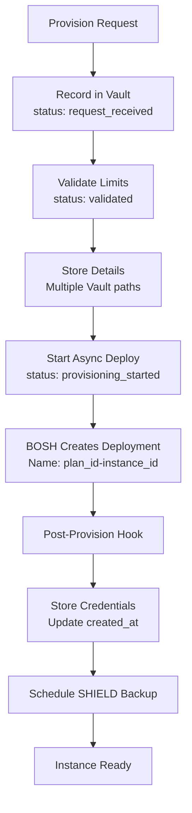
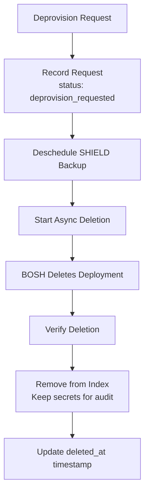
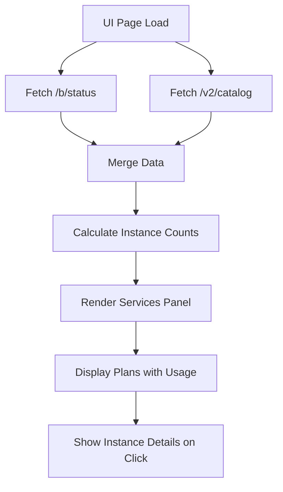

# Service Instance Management Workflow in Blacksmith

## Overview

Blacksmith tracks and manages service instances through a coordinated system involving the UI, backend API, Vault storage, and a reconciler component that ensures consistency between BOSH deployments and tracked instances.

## Architecture Components

### 1. Vault Storage Layer

Service instances are persistently stored in Vault with a multi-path strategy for different aspects of instance data.

#### Primary Index: `db`
The main index at path `db` contains all active service instances, indexed by UUID:

```json
{
  "{instance-uuid}": {
    "service_id": "service-identifier",
    "plan_id": "plan-identifier",
    "created": 1234567890,              // Unix timestamp (legacy)
    "created_at": "2024-01-01T00:00:00Z",
    "requested_at": "2024-01-01T00:00:00Z",
    "status": "provisioning_started",
    "plan": {
      "id": "plan-identifier",
      "name": "Plan Display Name"
    }
  }
}
```

#### Instance-Specific Paths

- **`{instanceID}/`** - Root instance data with flattened fields for backward compatibility
- **`{instanceID}/deployment`** - Deployment-specific information including organization/space details
- **`{instanceID}/{deploymentName}`** - Full provision details object
- **`{instanceID}/manifest`** - BOSH deployment manifest (added by reconciler)
- **`{instanceID}/metadata`** - Historical metadata including lifecycle timestamps
- **`{instanceID}/credentials`** - Service credentials after successful provisioning

### 2. Backend API Layer

#### Status Endpoint: `/b/status`

The primary endpoint for retrieving service instance data:

```go
// internal_api.go:257-291
idx, err := api.Vault.GetIndex("db")
out := struct {
    Env       string      `json:"env"`
    Version   string      `json:"version"`
    Instances interface{} `json:"instances"`  // Vault db index data
    Plans     interface{} `json:"plans"`      // Broker plan configurations
    Log       string      `json:"log"`
}{
    Instances: idx.Data,
    Plans:     deinterface(api.Broker.Plans),
}
```

#### Additional Endpoints

- `/v2/catalog` - Service catalog from Open Service Broker API
- `/b/cleanup` - Manual orphan instance cleanup
- `/b/deployments/{name}/events` - BOSH deployment events
- `/b/deployments/{name}/vms` - VM information for deployments

### 3. Service Instance Lifecycle

#### Provisioning Workflow



**Key Steps:**

1. **Immediate Recording**: Instance tracked in Vault before any deployment begins
2. **Limit Validation**: Plan limits checked against current usage
3. **Async Deployment**: BOSH deployment initiated in background
4. **Post-Provision**: Credentials fetched and stored, backups scheduled

#### Deprovisioning Workflow



**Important Notes:**
- Instance only removed from index after confirmed BOSH deletion
- Secrets preserved in Vault for audit purposes (never deleted)
- Deletion timestamps tracked in metadata

### 4. Reconciler Component

The reconciler ensures consistency between BOSH deployments and Vault records.

#### Configuration

Environment variables control reconciler behavior:

| Variable | Default | Description |
|----------|---------|-------------|
| `BLACKSMITH_RECONCILER_ENABLED` | `true` | Enable/disable reconciler |
| `BLACKSMITH_RECONCILER_INTERVAL` | `1h` | Scan interval |
| `BLACKSMITH_RECONCILER_MAX_CONCURRENCY` | `5` | Parallel operations |
| `BLACKSMITH_RECONCILER_BATCH_SIZE` | `10` | Instances per batch |
| `BLACKSMITH_RECONCILER_RETRY_ATTEMPTS` | `3` | Retry failed operations |
| `BLACKSMITH_RECONCILER_CACHE_TTL` | `5m` | Cache duration |

#### Reconciliation Process


**Reconciliation adds:**
- `reconciled: true` flag
- `reconciled_at` timestamp
- `last_synced_at` timestamp
- Updated manifest if changed

#### Orphan Detection

The system identifies orphaned instances (Vault records without BOSH deployments):

1. Retrieves all BOSH deployments
2. Checks each Vault instance for matching deployment
3. Uses naming convention: `{plan_id}-{instance_id}`
4. Removes orphaned instances from index
5. Logs cleanup actions for audit

### 5. UI Integration

#### Data Flow



#### UI Processing (blacksmith.js)

1. **Data Fetching**: Parallel requests to `/b/status` and `/v2/catalog`
2. **Data Merging**: Combines catalog metadata with instance data
3. **Count Calculation**: Tallies instances per plan
4. **Plan Enhancement**: Adds instance count and limit to each plan
5. **Rendering**: Updates services panel with enriched data

### 6. Status Progression

Service instances progress through defined statuses:

| Status | Description |
|--------|-------------|
| `request_received` | Initial provision request recorded |
| `validated` | Limits and parameters validated |
| `provisioning_started` | BOSH deployment initiated |
| `provisioning_completed` | Deployment successful |
| `deprovision_requested` | Deletion requested |
| `deprovisioning` | BOSH deletion in progress |

### 7. Data Consistency Strategies

#### Eventual Consistency
- Reconciler periodically synchronizes Vault with BOSH state
- Handles deployments created/deleted outside normal flow
- Updates stale or missing metadata

#### Failure Handling
- Failed provisions: Deployment cleaned up, instance marked failed
- Failed deprovisions: Instance retained in index for investigation
- Network failures: Retry logic with exponential backoff

#### Audit Trail
- All lifecycle events timestamped
- Deleted instances keep vault data minus index entry
- Reconciliation history maintained in metadata

## Key Design Decisions

### 1. Dual Storage Strategy
- **Index**: Fast lookups and queries
- **Detailed Paths**: Complete data preservation

### 2. Asynchronous Operations
- All BOSH operations are async with status polling
- UI uses LastOperation pattern for status updates

### 3. Naming Convention
- Deployments: `{plan_id}-{instance_id}`
- Enables automatic correlation between BOSH and Vault

### 4. Preservation Over Deletion
- Audit requirements satisfied by keeping deleted instance data
- Only index entries removed, not underlying secrets

### 5. Reconciliation Safety
- Read-only scanning of BOSH
- Non-destructive Vault updates
- Preserves manual changes while adding metadata

## Monitoring and Observability

### Metrics Available
- Total reconciliation runs
- Successful vs failed runs
- Instances found/synced/orphaned
- Average reconciliation duration

### Log Points
- Instance lifecycle transitions
- Reconciliation actions
- Orphan detection and cleanup
- API request/response cycles

### Health Checks
- Reconciler status endpoint
- Vault connectivity
- BOSH director availability
- Index consistency validation

## Security Considerations

1. **Credential Storage**: Service credentials stored encrypted in Vault
2. **Access Control**: Vault ACLs control instance data access
3. **Audit Logging**: All modifications tracked with timestamps
4. **Data Retention**: Deleted instances retained for compliance
5. **TLS Communication**: All BOSH/Vault communication over TLS

## Troubleshooting Guide

### Common Issues

#### Orphaned Instances
- **Symptom**: Instances in UI with no backing deployment
- **Solution**: Run `/b/cleanup` endpoint or wait for reconciler

#### Stuck Provisioning
- **Symptom**: Instance stays in `provisioning_started`
- **Check**: BOSH task status via deployment events
- **Solution**: Check BOSH logs, may need manual intervention

#### Missing Instance Data
- **Symptom**: Incomplete instance information in UI
- **Solution**: Force reconciliation to rebuild metadata

#### Reconciler Not Running
- **Check**: Reconciler status via adapter
- **Solution**: Verify environment variables and restart

### Debugging Commands

```bash
# Check reconciler status
curl http://blacksmith/internal/reconciler/status

# Force immediate reconciliation
curl -X POST http://blacksmith/internal/reconciler/reconcile

# View instance in Vault
vault read secret/blacksmith/instances/{instance-id}

# Check BOSH deployment
bosh -d {plan-id}-{instance-id} deployment
```

## Future Enhancements

1. **Real-time Updates**: WebSocket support for live instance status
2. **Batch Operations**: Bulk provisioning/deprovisioning
3. **Enhanced Metrics**: Prometheus/Grafana integration
4. **Backup/Restore**: Full instance state backup capability
5. **Multi-region**: Cross-region instance management